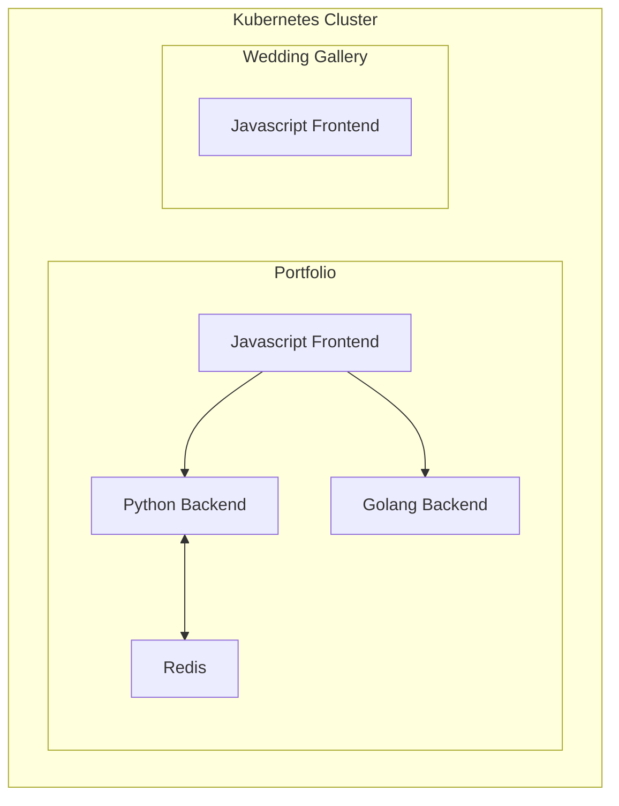

# NDSquared

This repo contains the collection of application code and corresponding helm charts I use in my [personal Kubernetes cluster](https://github.com/dannylongeuay/do-infra).

**Applications**:

- [Portfolio](https://www.ndsquared.net)
  - [Python Backend](https://api.ndsquared.net/docs)
  - [Golang Backend](https://goapi.ndsquared.net/docs)
- [Wedding Gallery](https://wedding.ndsquared.net)

## Deployment

Applications are deployed to the Kubernetes cluster using [Helm](https://helm.sh/). This is automated via [GitHub Actions](https://github.com/features/actions).

## Architecture

The following is a brief diagram of the application components:



## Local Development

Local development utilizes a tool called [Tilt](https://tilt.dev/), a microservice development environment for engineers that deploy to Kubernetes.

### Requirements

- [ASDF-VM](https://asdf-vm.com/)
- [Docker](https://www.docker.com/)

### Make targets

```
❯ make
help                           View help information
asdf-bootstrap                 Install all tools through asdf-vm
kubectl-bootstrap              Create namespaces in k3d cluster
bootstrap                      Perform all bootstrapping required for local development
clean                          Destroy local development environment
up                             Run local development environment
down                           Stop local development environment
gitlab-secret                  Create a gitlab secret to be used with the external secrets store
```
